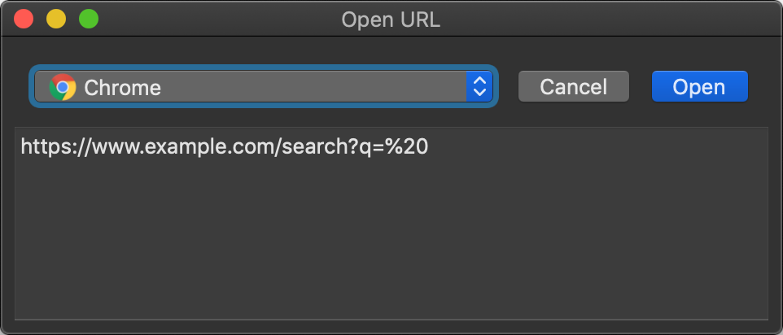

Default Browser
==

Take control over links opened by other apps, and pick a browser to open them.

Install
--

Drop the app into `/Applications` directory.

Open System Preferences – General, and set `Default web browser` to this app.
